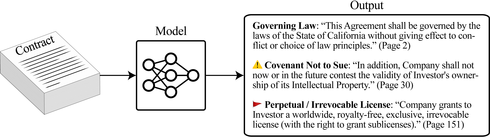

# Contract Understanding Atticus Dataset

This repository contains code for the [Contract Understanding Atticus Dataset (CUAD)](https://www.atticusprojectai.org/cuad), a dataset for legal contract review curated by the Atticus Project. It is part of the associated paper [CUAD: An Expert-Annotated NLP Dataset for Legal Contract Review](https://arxiv.org/abs/2103.06268) by [Dan Hendrycks](http://danhendrycks.com/), [Collin Burns](http://collinpburns.com), Anya Chen, and Spencer Ball.

Contract review is a task about "finding needles in a haystack." 
We find that Transformer models have nascent performance on CUAD, but that this performance is strongly influenced by model design and training dataset size. Despite some promising results, there is still substantial room for improvement. As one of the only large, specialized NLP benchmarks annotated by experts, CUAD can serve as a challenging research benchmark for the broader NLP community.

For more details about CUAD and legal contract review, see the [Atticus Project website](https://www.atticusprojectai.org/cuad).

## Trained Models

We [provide checkpoints](https://zenodo.org/record/4599830) for three of the best models fine-tuned on CUAD: RoBERTa-base (~100M parameters), RoBERTa-large (~300M parameters), and DeBERTa-xlarge (~900M parameters). 

## Extra Data
Researchers may be interested in several gigabytes of unlabeled contract pretraining data, which is available [here](https://drive.google.com/file/d/1of37X0hAhECQ3BN_004D8gm6V88tgZaB/view?usp=sharing).

## Requirements

This repository requires the HuggingFace [Transformers](https://huggingface.co/transformers) library. It was tested with Python 3.8, PyTorch 1.7, and Transformers 4.3/4.4. 

## Citation

If you find this useful in your research, please consider citing:

    @article{hendrycks2021cuad,
          title={CUAD: An Expert-Annotated NLP Dataset for Legal Contract Review}, 
          author={Dan Hendrycks and Collin Burns and Anya Chen and Spencer Ball},
          journal={arXiv preprint arXiv:2103.06268},
          year={2021}
    }
